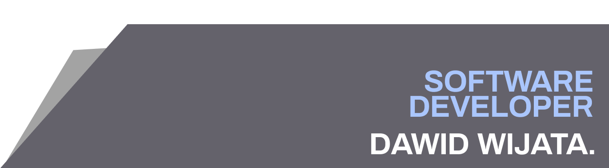

# Hi guys!

My name is Dawid Wijata. I'm a software engineer from Warsaw, Poland. I'm currently finishing my B. Sc. in Computer Science at WULS in Warsaw. You can find me on [![LinkedIn][1.2]][1]

### :office: Commercial experience
My work experience is mostly based on developing and maintaining software on **Angular / .NET** environment. 

### :mortar_board: Academic projects
I've also ran several repositories containing projects that I make for various subjects at university. Recently I've made a tool with Python and Kivy which helps me while planning the month schedule at work.

### :house: After getting all things above done
After hours, I like developing applications which solve my everyday problems or just let me have fun :satisfied:.

### :wrench: Technology stack

In my programming career I used many technologies and software engineering concepts but I mainly use these ones to create software:

#### Backend

- .NET
- ASP.NET
- NSwag
- Entity Framework Core
- SignalR

#### Frontend

- Angular
- Vue 
- single-spa
- TypeScript / JavaScript
- HTML, (S)CSS

[1.2]: https://raw.githubusercontent.com/MartinHeinz/MartinHeinz/master/linkedin-3-16.png

[1]: https://www.linkedin.com/in/dawid-wijata/
